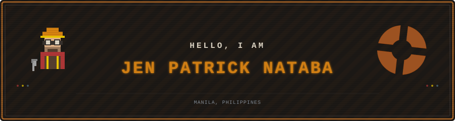
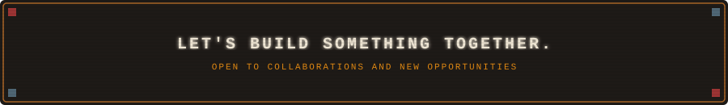

<!-- 
  ██████╗██╗   ██╗████████╗ ██████╗      ██╗███████╗███╗   ██╗
 ██╔════╝╚██╗ ██╔╝╚══██╔══╝██╔═══██╗     ██║██╔════╝████╗  ██║
 ██║      ╚████╔╝    ██║   ██║   ██║     ██║█████╗  ██╔██╗ ██║
 ██║       ╚██╔╝     ██║   ██║   ██║██   ██║██╔══╝  ██║╚██╗██║
 ╚██████╗   ██║      ██║   ╚██████╔╝╚█████╔╝███████╗██║ ╚████║
  ╚═════╝   ╚═╝      ╚═╝    ╚═════╝  ╚════╝ ╚══════╝╚═╝  ╚═══╝
  
  // IDDQD — GOD MODE ACTIVATED
  // ↑ ↑ ↓ ↓ ← → ← → B A START
  // "It's dangerous to go alone! Take this README."
-->

<div align="center">

<!-- ═══════════════════════════════════════════════════════════════ -->
<!-- ░░░░░░░░░░░░░░░░░░░░  HERO SECTION  ░░░░░░░░░░░░░░░░░░░░░░░ -->
<!-- ═══════════════════════════════════════════════════════════════ -->



<br/>

<!-- Animated Typing Introduction -->
<a href="https://git.io/typing-svg">
  
</a>

<br/>

<!-- Quick Action Badges -->
<a href="https://linkedin.com/in/cytojen/">
  
</a>&nbsp;
<a href="mailto:jenpatricknataba@gmail.com">
  
</a>&nbsp;

</div>

<br/>

## About Me

```yaml
name:           "Jen Patrick G. Nataba"
location:       "Manila, Philippines 🇵🇭"
interests:      ["Data Engineering", "Machine Learning", "AWS Cloud", "Open Source"]
education:      "BS Computer Science @ Polytechnic University of the Philippines (2023–2027)"
certifications: ["DataCamp Certified DE", "IBM Data Science (US-ASEAN STIC)", "HarvardX CS50"]
currently:      "Building data pipelines, training ML models, and exploring cloud architecture"
```

> *I'm a hands-on data engineer and ML practitioner who loves turning messy data into something meaningful. I've had the chance to work with organizations like Angat Buhay, Booky, and Omdena - building end-to-end pipelines, interactive dashboards, and ML models that actually drive decisions. I often see myself chasing the "why" behind every data point.*

<br/>

## Tech Stack

| Category | Technologies |
| :--- | :--- |
| **Languages** |     |
| **Data Engineering** |      |
| **Machine Learning** |      |
| **Cloud (AWS)** |       |
| **Databases** |    |
| **Backend** |   |
| **Frontend** |    |
| **Data Visualization** |      |
| **Tools** |     |

<br/>

<!--
## GitHub Stats

<div align="center">

&lt;!-- GitHub Stats &amp; Top Languages side by side --&gt;
<a href="https://github.com/cytojen">
  
</a>
&nbsp;&nbsp;
<a href="https://github.com/cytojen">
  
</a>

<br/><br/>

&lt;!-- GitHub Streak --&gt;
<a href="https://github.com/cytojen">
  
</a>

<br/><br/>

&lt;!-- Activity Graph --&gt;
<a href="https://github.com/cytojen">
  
</a>

<br/><br/>

&lt;!-- GitHub Trophies --&gt;
<a href="https://github.com/cytojen">
  
</a>

<br/><br/>

&lt;!-- Contribution Snake --&gt;
<picture>
  <source media="(prefers-color-scheme: dark)" srcset="https://raw.githubusercontent.com/cytojen/cytojen/output/github-snake-dark.svg" />
  <source media="(prefers-color-scheme: light)" srcset="https://raw.githubusercontent.com/cytojen/cytojen/output/github-snake.svg" />
  
</picture>

</div>

<br/>
-->

<br/>

<div align="center">



</div>

<!-- 
<!--

╔══════════════════════════════════════════════════════════╗
║  YOU FOUND THE INTEL!                                    ║
║  ──────────────────────────────────────────────          ║
║                                                          ║
║  Well, look who made it past the sentries.               ║
║                                                          ║
║  If you're reading this, you've successfully             ║
║  captured the intelligence. Nice work.                   ║
║                                                          ║
║  ─── CLASS FILE ───                                      ║
║                                                          ║
║  Main: Sniper                                            ║
║  Philosophy: "Professionals have standards."             ║
║                                                          ║
║    • Be polite.                                          ║
║    • Be efficient.                                       ║
║    • Have a plan to debug every bug you meet.            ║
║                                                          ║
║  (Close enough.)                                         ║
║                                                          ║
║  ──────────────────────────────────────────────          ║
║                                                          ║
║  Thanks for reading the source.                          ║
║                                                          ║
║  Now quit standing still...                              ║
║  You're making yourself an easy headshot.                ║
║                                                          ║
╚══════════════════════════════════════════════════════════╝

-->
